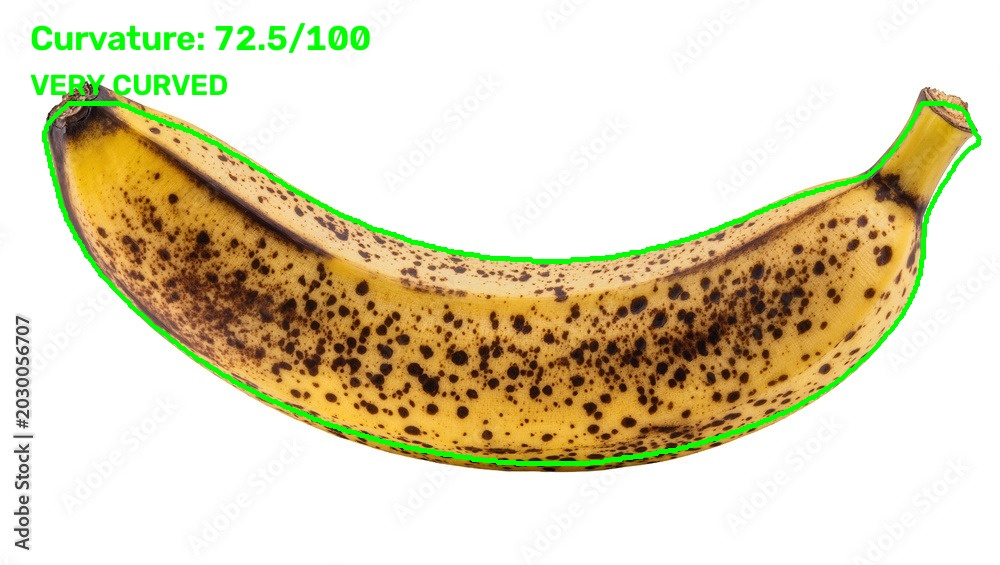
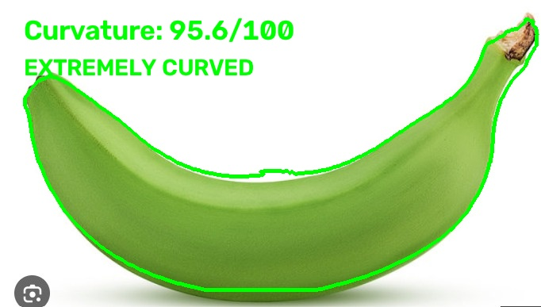
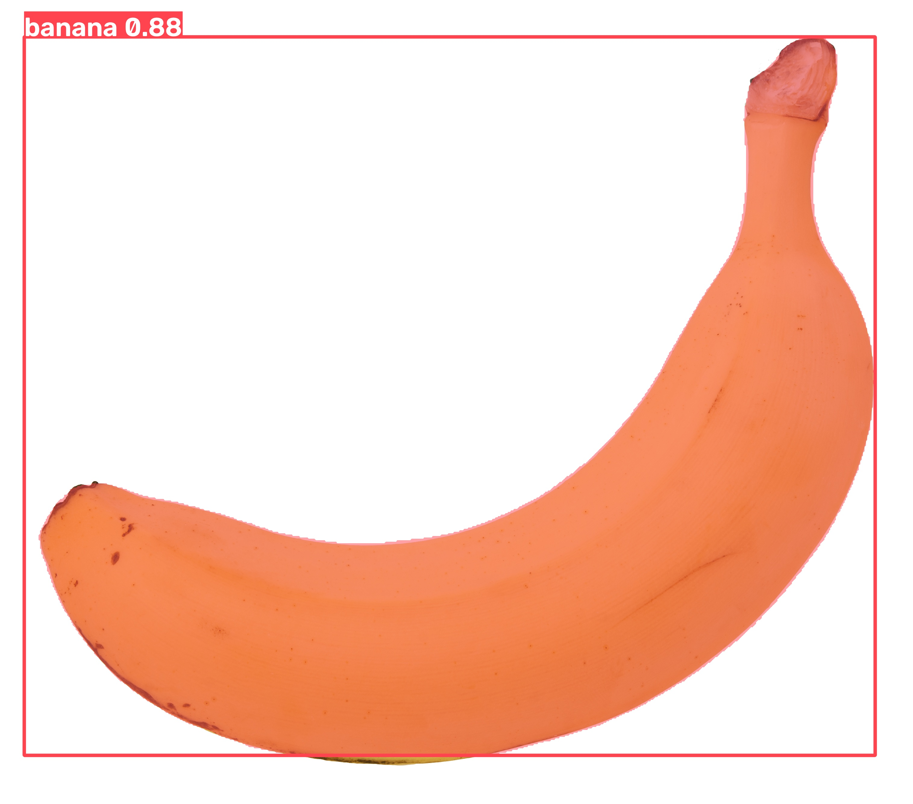
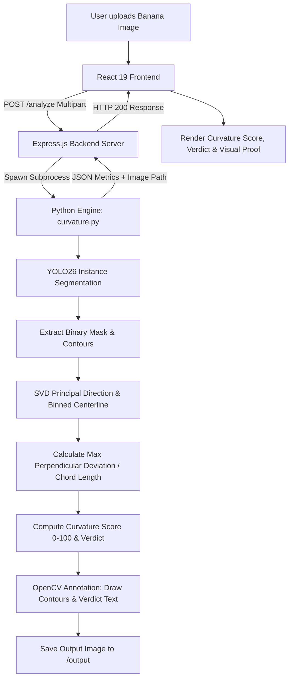

# BananaMath 🍌📐

## Basic Details
### Team Name: BananaMath

### Team Members
- Team Lead: Anand V R - [College]
- Member 2: Jareena Banu S - [College]

### Project Description
BananaMath is an advanced computer vision and geometry application that analyzes any banana to scientifically determine its curvature score (0–100). Powered by YOLO segmentation and Singular Value Decomposition (SVD) centerline tracking, it delivers mathematical certainty and witty classifications for a problem that never needed solving.

### The Problem (that doesn't exist)
For millennia, consumers and fruit connoisseurs have purchased bananas in absolute darkness—subject to the chaotic whims of agricultural curvature. Is your banana suspiciously straight? Is it moderately curved? Or has it completely rejected Euclidean geometry to become an unsolvable mathematical paradox? Without rigorous algorithmic scoring, civilization simply cannot function.

### The Solution (that nobody asked for)
BananaMath combines state-of-the-art YOLO26 instance segmentation, coordinate geometry, and SVD/PCA vector analysis to quantify the exact curvature of any banana. It segments the fruit, traces its non-linear centerline across perpendicular projection bins, computes maximum deviation relative to chord length, and renders annotated visual proof along with existential verdicts like *"This banana has rejected the concept of straight lines."*

## Technical Details

### Technologies/Components Used
For Software:
- **Languages used:** Python 3.11+, JavaScript (ES6+)
- **Frameworks used:** Express.js (Backend API), React 19 + Vite (Frontend UI)
- **Libraries used:** 
  - `ultralytics` (YOLO26-seg instance segmentation)
  - `opencv-python` (`cv2` contour extraction and annotation)
  - `numpy` (SVD, projection, median centerline calculation)
  - `multer` (multipart file upload handling)
  - `cors` (cross-origin resource sharing)
- **Tools used:** Git, GitHub, VS Code, Node.js, npm

For Hardware:
- *N/A (Pure Software Application)*

---

## Implementation

### Implementation
For Software:

# Installation
```bash
# 1. Clone the repository
git clone https://github.com/Anandvr0/banana_detector.git
cd banana_detector

# 2. Install Python dependencies
pip install -r requirements.txt

# 3. Install Backend dependencies
cd backend
npm install

# 4. Install Frontend dependencies
cd ../frontend
npm install
```

# Run
```bash
# Start Backend Server (runs on http://localhost:5000)
cd backend
node server.js

# In a separate terminal, start Frontend (runs on http://localhost:5173)
cd frontend
npm run dev

# Or run the CLI test directly:
python curvature.py test_images/yellow_banana.jpeg
```

---

### Project Documentation
For Software:

# Screenshots

*Curvature Analysis: High-precision contour extraction detecting a Moderately Curved banana (Curvature Score: 53.8/100).*


*Curvature Analysis: Detection and classification of a Slightly Curved green banana.*


*YOLO Instance Segmentation: Validating banana class identification and bounding box confidence.*

# Diagrams

*Architecture & Pipeline: From image upload to YOLO segmentation, SVD geometric analysis, and interactive UI display.*

For Hardware:
- *N/A (Pure Software Application)*

### Project Demo
# Video
[Add your demo video link here]
*A walkthrough demonstration showcasing the React interface, live banana image upload, instant curvature scoring, and generated visual proof.*

# Additional Demos
[Add any extra demo materials/links]

---

## Team Contributions
- **Anand V R:** Backend API architecture, Express-Python subprocess bridge, frontend UI development, and repository management.
- **Jareena Banu S:** Computer vision pipeline, YOLO26 segmentation integration, curvature mathematical algorithm, and testing.

---
Made with ❤️ at TinkerHub Useless Projects 


